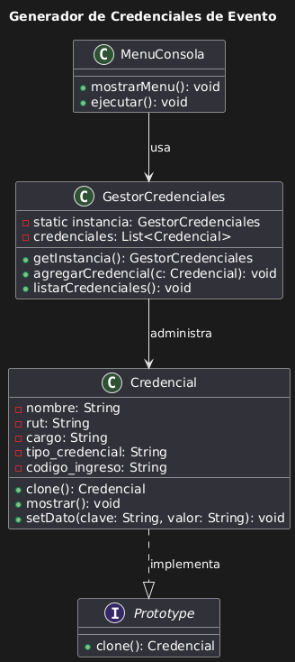
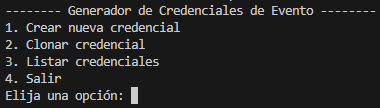
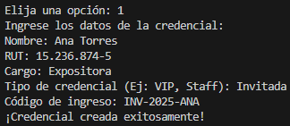
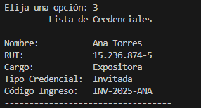
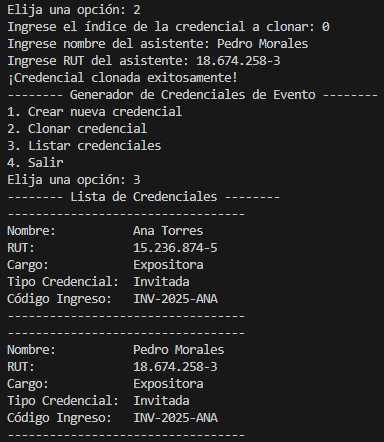

# 🪪 Generador de Credenciales de Evento

### Estudiante(s):  
- José Flores – Patrones de Diseño (Sección 1)

---

## 🎯 Objetivo del Proyecto

El objetivo de este proyecto es diseñar e implementar un sistema de generación de credenciales personalizadas para un evento, a partir de una plantilla base reutilizable. Para ello, se aplican dos patrones de diseño clave:

- **Prototype:** Permite clonar objetos `Credencial` de manera eficiente para reutilizar la estructura base y modificar solo los campos necesarios.
- **Singleton:** Garantiza una única instancia del gestor central del sistema (`GestorCredenciales`), que administra las credenciales creadas.

El sistema es ejecutado completamente desde consola y permite gestionar credenciales con campos personalizados como nombre, RUT, cargo, tipo de credencial y código de acceso alfanumérico.

---

## 🚀 Cómo ejecutar

1. Clonar el repositorio:
```bash
git clone https://github.com/P1POX/CredencialesEvento.git
cd CredencialesEvento
```

2. Compilar y ejecutar:
```bash
javac Main.java
java Main
```

---

## 🧬 Patrón Prototype – Aplicación

El patrón Prototype se aplica en la clase `Credencial`, que implementa `Cloneable`. Esto permite crear nuevas credenciales a partir de una plantilla base clonada.

```java
Credencial plantilla = new Credencial("Nombre", "RUT", "Cargo", "Tipo", "Código");
Credencial clon = plantilla.clone();
clon.setDato("nombre", "Tulio Triviño");
```
- Se usa una **deep copy** para evitar conflictos entre clones.
- Cada clon puede tener sus propios valores únicos sin alterar la plantilla original.
---

## 🔒 Patrón Singleton – Aplicación

El patrón Singleton se implementa en la clase `GestorCredenciales`, encargada de gestionar la lista global de credenciales generadas.

```java
GestorCredenciales gestor = GestorCredenciales.getInstancia();
gestor.agregarCredencial(credencial);
```
- Se garantiza que solo exista una instancia del gestor durante toda la ejecución del sistema.
- El constructor es privado y el acceso se realiza mediante `getInstancia()`.
---

## 🖥️ Menú por consola

```
--- MENÚ ---
1. Crear nueva credencial
2. Clonar credencial
3. Listar credenciales
4. Salir
```
Cada credencial generada muestra en consola los campos personalizados ingresados por el usuario.

---

## 📊 Diagrama de Clases (UML)



El diagrama incluye las clases: `Credencial`, `GestorCredenciales`, y `MenuConsola`. Se muestran claramente los patrones **Prototype** y **Singleton** con sus relaciones y métodos clave.

---

## 📸 Captura del sistema funcionando
Menú del programa



Registro de una nueva credencial



Listado de credenciales



Clonación de credencial

